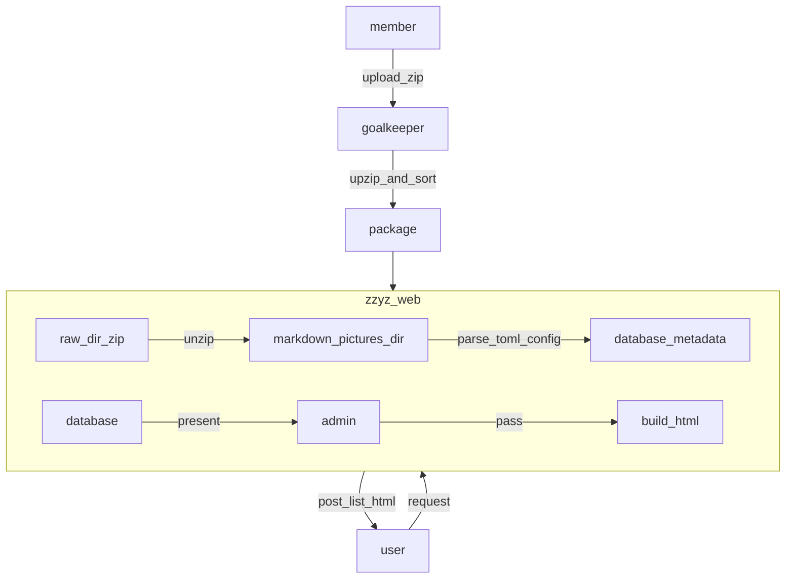
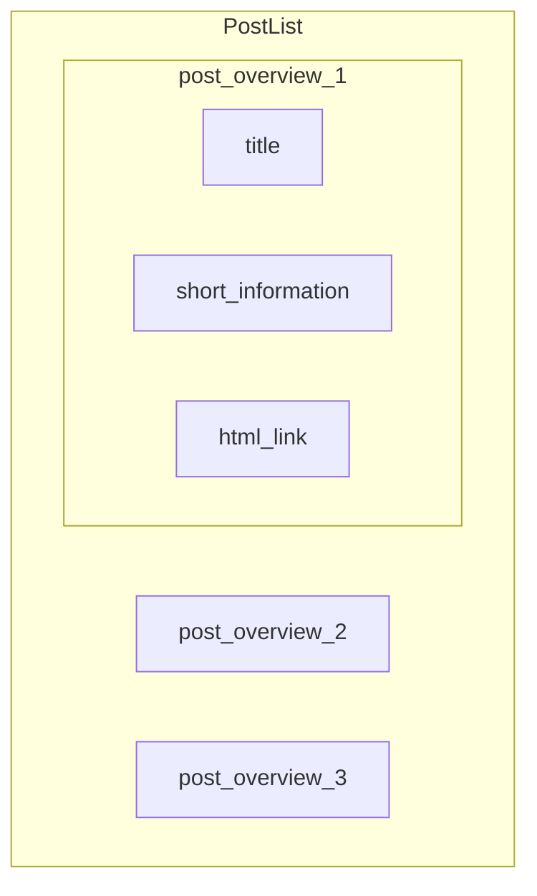

# System Architecture Diagram





---

## GoadKeeper

`config.toml` 模板

```toml
# 成员 id (由后端添加成员的时候生成)
member_id = 1

# 作者名称 (允许昵称)
author = "张三"

# 邮箱 可选, 没有填写放空即可
email = ""

# 主文件类型
# TODO: 可选项 [ docx, md, doc, html ]
# WARN: 当前支持 [ md, html ]
index_format = "md"

# 文章标题
title = "如何做好一个golang后端"

# 文章概要(多行使用三个双引号)
overview = """
这是一篇关于如何做好golang后端的文章.
主要涉及接口设计， 系统分析，流程图制作等
"""

# 表示文章状态
# 0 新添加的文章
# 1 更新文章
# -1 退回之后进行修改的文章
status = 0

# NOTE: 如果是全新的文章则不需要填写
# WARN: 如果是退回的或者更新的文章需要填写
# TODO: 通过简易的 html 页面查看文章列表
post_id = -1

# 直接写标签, 如果不存在则自动创建新的标签
# 每个文章只支持 3 个标签以内
# WARN: 如果系统的总标签数量超过 20 则会拒绝创建
# 查看网页前端获取现在已有的标签
tags = ["golang", "CS"]
```

**GoadKeeper** 根据 member 整理上交的原始内容

保证打包后的 zip 包符合下面的格式 

```bash
package
├── assets
│   ├── note.pdf
│   ├── notes.tar.xz
│   ├── pic1.png
│   ├── pic2.png
│   ├── pic3.png
│   └── presentation.pptx
├── config.toml
└── index.unknown
```

- assets 当中的内容是member提供的附件， 根据需要进行整理和编排

- **务必保证 index.unknown 当中对于 assets当中的引用是相对路径**

**打包压缩统一使用 zip**

- 压缩命令

```bash
zip -r package package
```

这个命令会产生一个 `package.zip` 压缩包， 将这个压缩包上传至系统即可

**注意， 解压缩之后是一个文件夹**
